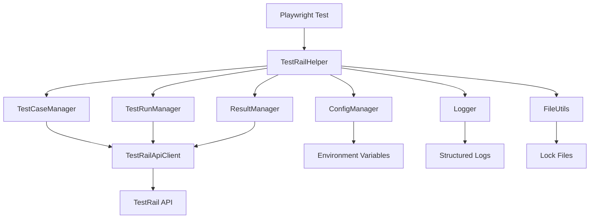

# TestRail Playwright Helper Architecture

## 🏗️ System Architecture Overview

The TestRail Playwright Helper is designed as a modular, type-safe npm package that provides seamless integration between Playwright test automation and TestRail test management.

## 📦 Package Structure

```
src/
├── index.ts                    # Main package export
├── types/
│   └── index.ts               # TypeScript type definitions
├── config/
│   ├── TestRailConfig.ts      # Configuration management
│   └── constants.ts           # TestRail constants and mappings
├── client/
│   └── TestRailApiClient.ts   # HTTP client for TestRail API
├── managers/                  # Business logic managers (Week 2+)
│   ├── TestCaseManager.ts     # Test case operations
│   ├── TestRunManager.ts      # Test run management
│   └── ResultManager.ts       # Result processing
├── coordination/              # Worker coordination (Week 3+)
│   └── WorkerCoordinator.ts   # Multi-worker coordination
└── utils/
    ├── Logger.ts              # Structured logging
    └── FileUtils.ts           # File operations
```

## 🔧 Core Components

### 1. Configuration Layer (`config/`)

**Purpose**: Centralized configuration management with validation

**Components**:
- `TestRailConfig.ts`: Singleton configuration manager
- `constants.ts`: TestRail API constants and mappings

**Key Features**:
- Environment variable support
- Runtime validation
- Type-safe configuration
- Singleton pattern for global access

### 2. Type System (`types/`)

**Purpose**: Comprehensive TypeScript type definitions

**Key Features**:
- Strict type safety (no `any` types)
- Runtime validation interfaces
- Custom error types
- API response types

### 3. HTTP Client (`client/`)

**Purpose**: Robust HTTP communication with TestRail API

**Key Features**:
- Retry logic with exponential backoff
- Authentication handling
- Error classification and recovery
- Request/response interceptors
- Timeout management

### 4. Business Logic Managers (`managers/`)

**Purpose**: High-level business operations (Week 2+ implementation)

**Planned Components**:
- `TestCaseManager`: Test case synchronization and management
- `TestRunManager`: Test run lifecycle management
- `ResultManager`: Test result processing and submission

### 5. Utilities (`utils/`)

**Purpose**: Common utilities and helper functions

**Components**:
- `Logger`: Structured JSON logging with context
- `FileUtils`: Async file operations and lock coordination

## 🔄 Data Flow Architecture



## 🎯 Design Principles

### 1. **Separation of Concerns**
- Each component has a single, well-defined responsibility
- Clear interfaces between layers
- Minimal coupling between components

### 2. **Type Safety**
- Strict TypeScript configuration
- No `any` types in public APIs
- Runtime validation at boundaries

### 3. **Error Handling**
- Custom error types for different scenarios
- Graceful degradation on failures
- Comprehensive error context

### 4. **Performance**
- Async operations throughout
- Connection reuse in HTTP client
- Efficient data structures
- Caching where appropriate

### 5. **Testability**
- Dependency injection support
- Mockable interfaces
- Comprehensive test coverage
- Clear test boundaries

## 🔐 Security Considerations

### 1. **Credential Management**
- Environment variable support
- No hardcoded credentials
- Secure credential validation

### 2. **API Security**
- Proper authentication headers
- Request validation
- Error message sanitization

### 3. **Input Validation**
- Configuration validation
- API input sanitization
- Type checking at runtime

## 🚀 Performance Architecture

### 1. **HTTP Optimization**
- Connection reuse
- Request batching (where possible)
- Intelligent retry strategies
- Timeout management

### 2. **Memory Management**
- Efficient data structures
- Proper cleanup mechanisms
- Streaming for large datasets

### 3. **Concurrency**
- Worker coordination system
- Lock file management
- Race condition prevention

## 📊 Monitoring & Observability

### 1. **Logging Strategy**
- Structured JSON logging
- Configurable log levels
- Context-aware logging
- Performance metrics

### 2. **Error Tracking**
- Detailed error context
- Error classification
- Recovery attempt tracking

### 3. **Health Monitoring**
- API response time tracking
- Success/failure rates
- Worker coordination health

## 🔄 Extension Points

### 1. **Custom Managers**
- Plugin architecture for custom business logic
- Interface-based extension
- Configuration-driven behavior

### 2. **Custom Coordination**
- Pluggable coordination strategies
- Support for different queue systems
- Custom lock mechanisms

### 3. **Custom Logging**
- Pluggable log destinations
- Custom log formatters
- Integration with monitoring systems

## 📈 Scalability Considerations

### 1. **Horizontal Scaling**
- Multi-worker support
- Distributed coordination
- Load balancing strategies

### 2. **Vertical Scaling**
- Memory-efficient operations
- CPU optimization
- I/O optimization

### 3. **API Rate Limiting**
- Intelligent backoff strategies
- Request queuing
- Priority-based processing

## 🔧 Development Architecture

### 1. **Build System**
- TypeScript compilation
- Source map generation
- Type declaration generation

### 2. **Testing Strategy**
- Unit tests with high coverage
- Integration tests
- Mock-based testing
- Performance testing

### 3. **Quality Assurance**
- ESLint configuration
- Prettier formatting
- Pre-commit hooks
- Continuous integration

This architecture provides a solid foundation for the TestRail Playwright Helper, ensuring maintainability, scalability, and reliability while maintaining excellent developer experience.